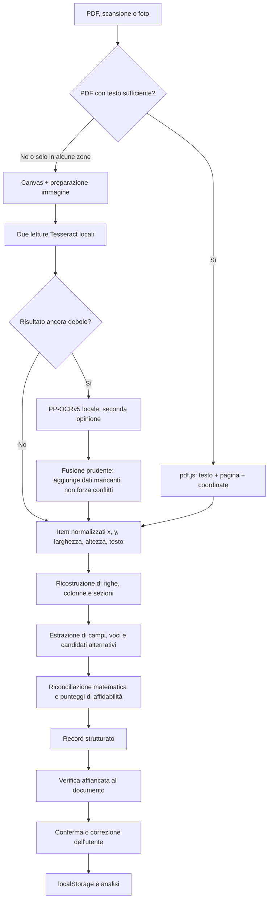

# BustaChiara

**La busta paga italiana, spiegata — 100% privata, 100% offline e installabile su ogni dispositivo.**

BustaChiara legge le tue buste paga (PDF, scansioni o foto), ricostruisce i dati principali,
rifà i conti (IRPEF, INPS, TFR, ferie, permessi e minimi contrattuali), segnala ciò che non
torna e crea un **riassunto semplice** del mese. Tutto avviene **dentro il tuo browser**:
il documento, il testo estratto e i dati confermati non vengono inviati a server, servizi
cloud o AI remote.

---

## 1. Apri e installa BustaChiara

### Link pubblico dell’app

**[Apri BustaChiara](https://MarvinBonazzo.github.io/bustachiara/)**

Per condividerla con altre persone basta inviare questo link. Non occorre cercare l’app su
App Store o Play Store: BustaChiara è una **PWA**, cioè un sito sicuro che si installa
direttamente sul dispositivo e poi si apre come una normale applicazione.

### iPhone e iPad

1. Apri il link con **Safari**.
2. Tocca **Condividi** — il quadrato con la freccia verso l’alto.
3. Scorri il menu e scegli **Aggiungi alla schermata Home**.
4. Tocca **Aggiungi**.
5. Apri BustaChiara dalla nuova icona comparsa nella schermata Home.

### Smartphone e tablet Android

1. Apri il link con **Google Chrome**.
2. Tocca il menu **⋮** in alto a destra.
3. Scegli **Installa app** oppure **Aggiungi alla schermata Home**.
4. Conferma con **Installa**.
5. Apri BustaChiara dall’icona nella schermata Home o dal cassetto delle applicazioni.

Se il browser mostra direttamente il pulsante **Installa**, puoi usare quello.

### PC Windows o Linux

1. Apri il link con **Google Chrome** o **Microsoft Edge**.
2. Clicca l’icona di installazione nella parte destra della barra degli indirizzi.
3. In alternativa, apri il menu del browser e scegli **Installa BustaChiara**.
4. Conferma: l’app comparirà nel menu Start/applicazioni e potrà avere un collegamento sul desktop.

Firefox può aprire e usare BustaChiara normalmente, ma per installarla come applicazione
desktop è consigliato Chrome o Edge.

### Mac

- **Safari 17 o successivo:** apri il link e scegli **File → Aggiungi al Dock**.
- **Chrome o Edge:** usa l’icona di installazione nella barra degli indirizzi oppure il
  comando **Installa BustaChiara** nel menu del browser.

### Dopo l’installazione

- Serve una connessione solo alla **prima apertura** e per ricevere gli aggiornamenti.
- Dopo il primo caricamento l’app funziona anche **offline**.
- Gli aggiornamenti arrivano automaticamente quando viene pubblicata una nuova versione.
- I dati restano nel browser del singolo dispositivo e non si sincronizzano: usa
  **Backup → Esporta tutto** per fare un backup o trasferirli.

Le stesse istruzioni sono sempre disponibili dentro l’app tramite il pulsante **Installa**.

---

> ⚠️ I dati (cronologia) sono salvati nel browser **del dispositivo che usi**: non si
> sincronizzano da soli tra dispositivi. Usa **Backup → Esporta tutto** per fare backup o
> passare i dati a un altro dispositivo.

L’analisi conserva elementi fissi, voci, TFR, ferie/permessi, progressivi, CCNL e controlli
automatici, ma l’interfaccia mostra prima ciò che serve davvero. **Riassunto** racconta il
mese in poche righe: lordo, trattenute, netto, ferie, TFR e differenze dovute a domeniche,
festivi, notturni o straordinari quando sono identificabili in modo affidabile. Le stime
economiche sono sempre indicate come importi lordi.

### Flusso tipico
1. **Home** → trascina o scegli un PDF, uno screenshot o una foto dal riquadro centrale.
   Un PDF **protetto da password** viene sbloccato soltanto in memoria; la password non
   viene conservata.
2. **Verifica** → l'app mostra tutto ciò che ha estratto; controlla e correggi. *I controlli
   valgono quanto i dati che confermi.*
3. **Riassunto** → mostra il flusso economico riconciliato al 100%, commenti concreti e
   soltanto gli avvisi che richiedono attenzione.
4. **Dettaglio** → mostra netto, dati utili, controlli urgenti e azioni sul record, senza
   una lunga spiegazione ripetitiva per ogni singola riga.
5. **Extra** → curiosità, dizionario, CCNL e fonti ufficiali. Le schede oggettive (TFR vs
   fondo pensione, quanto vale un'ora del tuo
   lavoro, quanti giorni di fila si può lavorare, quanto costi all'azienda, perché la 13ª
   sembra più tassata…): quasi tutte hanno un riquadro "I tuoi numeri" calcolato sulla TUA
   busta. L'app spiega i fatti e cosa cambia con ogni scelta; non dice mai cosa fare.
6. **Il progetto** (pulsante in alto) → perché esiste l'app e perché tutto è locale.

### Parser multi-layout

Il parser non dipende più da un solo gestionale, da una sola posizione della pagina o da
codici voce di lunghezza fissa. La lettura avviene a strati: testo/coordinate, riconoscimento
del layout, candidati alternativi per ogni campo, classificazione semantica e infine
controlli matematici. Il valore che quadra meglio viene scelto conservando provenienza e
affidabilità:

- riconosce sia codici brevi e numerici (`0`, `22`, `200`) sia codici alfanumerici
  (`Z00001`, `F02010`) e righe in cui codice e descrizione sono fusi;
- individua colonne chiamate in modi diversi (competenze/spettanze/accrediti,
  trattenute/ritenute/deduzioni, quantità/riferimento);
- legge anche riepiloghi separati di contributi, IRPEF, progressivi, TFR, ferie e permessi;
- legge i cedolini senza una classica tabella voci (per esempio NoiPA e lavoro domestico)
  attraverso etichette, contesto della sezione e ruolo economico dell'importo;
- gestisce importi italiani e internazionali (`1.234,56`, `1234,56`, `1234.56`) e PDF di
  più pagine;
- riconosce esplicitamente Jet HR e Zucchetti e applica euristiche generiche ai layout
  TeamSystem/LYNFA/GECOM, INAZ, Centro Paghe/Paghe Open, NoiPA, Sistemi JOB, ADP, SAP,
  Cassa Edile, lavoro domestico e ai cedolini non identificati;
- confronta tutte le combinazioni plausibili di competenze, trattenute, arrotondamento e
  netto e le confronta anche con le somme delle singole voci: questo evita di scambiare un
  imponibile o un progressivo per un totale del mese;
- verifica il calcolo `quantità × base`, ratei, paga oraria, imponibili, TFR e quadrature
  globali; se più interpretazioni sono vicine le presenta all'utente senza nasconderle;
- riconosce il tipo di documento (ordinario, cessazione, tredicesima, quattordicesima,
  conguaglio, arretrati, premio o rettifica) e permette di conservare più cedolini nello
  stesso mese, anche per datori diversi;
- applica moduli terminologici per privato/LUL, NoiPA, domestico, edilizia, agricoltura,
  marittimo, spettacolo/sportivo, dirigenti e cessazione/conguaglio;
- combina regole, sinonimi, somiglianza semantica e refusi per spiegare anche abbreviazioni
  mai viste, lasciando sempre visibile la descrizione originale;
- per le foto corregge orientamento, prospettiva, margini e inclinazione; nei PDF nativi
  esegue l'OCR soltanto sulle pagine in cui il testo estratto è insufficiente;
- nella verifica mostra il documento accanto ai campi: il pulsante sorgente evidenzia la
  zona da cui arriva il dato. Su mobile ogni riga diventa una scheda verticale leggibile;
- propone fino a tre CCNL, con punteggio e motivi, senza scegliere automaticamente quando
  il risultato è ambiguo.

Le correzioni alle causali proprietarie vengono apprese **solo sul dispositivo** e per lo
specifico software paghe. Dalla volta successiva la stessa descrizione viene classificata
come competenza, trattenuta o dato con il nome confermato dall'utente. Da **Backup** si può
anche controllare ed esportare un fixture per contribuire a nuovi test: identità, file ed
estratti della pagina vengono rimossi e gli importi trasformati mantenendo la quadratura.
Le causali proprietarie restano comunque da rileggere prima di pubblicarlo.

I test di regressione usano esclusivamente dati inventati. Oltre ai fixture storici, la
matrice settoriale copre 14 famiglie: LUL privato/Zucchetti, NoiPA, Cassa Edile,
agricoltura, lavoro domestico, cooperativa, somministrazione, dirigenti, turni e
maggiorazioni, tredicesima, quattordicesima, conguaglio fiscale, cessazione e OCR rumoroso.
Nel complesso la matrice verifica 46 voci economiche. Si eseguono con:

```bash
node tests/parser.test.mjs
node tests/ai-ocr.test.mjs
node tests/ui-pwa.test.mjs
```

Nessun parser, locale o online, può promettere precisione assoluta su ogni cedolino esistente:
scansioni rovinate, tabelle disegnate come immagini e personalizzazioni aziendali possono
richiedere correzioni. Per questo la schermata **Verifica** resta obbligatoria e distingue
una lettura buona da una parziale o bassa.

Metodo di ricerca, formati pubblici consultati e strategia per ampliare i test sono descritti
in [`docs/parser-research.md`](docs/parser-research.md). I PDF di ricerca e i cedolini reali
non sono inclusi nel repository.

Interfaccia: chiara e rassicurante, costruita attorno all’icona del **foglio illuminato**.
La Home contiene soltanto il riquadro di importazione e tre promesse verificabili:
"Funziona offline", "Privacy 100%" e "Non invii nessun dato a nessuno". **Riassunto** usa
un flusso riconciliato (netto, contributi, tasse e altre trattenute) le cui parti sommano
sempre al 100%. Schede in ordine Home · Riassunto · Dettaglio · Diritti minimi · Extra ·
Backup. Nell’intestazione restano
soltanto Il progetto, Installa e 100% privacy. Quando pubblichi un aggiornamento della PWA, alza la
versione della cache in `pwa/sw.js` (`bustachiara-v2`, `-v3`…) così i dispositivi scaricano
la novità.

Licenza: **MIT** (file `LICENSE`, riportata anche nel piè di pagina dell'app). Verificato
prima della pubblicazione: nei file del progetto non ci sono chiavi API, password o dati
personali — l'unica "busta" inclusa è l'esempio con dati inventati (Mario Rossi).

---

## 2. Privacy: come è garantita (non "promessa")

- Il file HTML contiene una **Content-Security-Policy** che blocca le connessioni verso
  origini esterne: `default-src 'none'` e `connect-src blob: data: 'self'`. `'self'` consente
  soltanto le risorse statiche e gli aggiornamenti provenienti dalla stessa installazione
  GitHub Pages/localhost; non autorizza API, analytics o server di terzi. Puoi verificarlo
  negli strumenti sviluppatore: durante l'analisi non parte alcuna richiesta esterna.
- pdf.js, Tesseract e il dizionario italiano sono inglobati nel file principale. Se due
  letture Tesseract restano incerte, l'app può richiedere dallo **stesso dominio** un secondo
  OCR locale PP-OCRv5/ONNX. I suoi file vengono scaricati solo in quel caso, conservati nella
  cache PWA e poi eseguiti nel browser; il documento e il testo riconosciuto non fanno parte
  della richiesta. Non vengono contattati CDN, API o servizi Google.
- La cronologia sta nel **localStorage del browser**. Il PDF originale **non** viene salvato:
  solo i dati estratti che confermi.
- Cancellando i dati di navigazione cancelli anche l'archivio → fai export periodici.
- L'export JSON contiene i tuoi dati in chiaro: trattalo come un documento riservato.

---

## 3. Cosa controlla automaticamente

| Controllo | Formula usata | Fonte |
|---|---|---|
| Quadratura netto | competenze − trattenute ± arrotondamento | aritmetica |
| Somma voci vs totali | Σ competenze, Σ trattenute | aritmetica |
| Contributo IVS | imponibile INPS × 9,19% (o 9,49% aziende CIGS) | INPS, circolare annuale |
| Contributo FIS | quota lavoratore = 1/3 dell'aliquota (0,50%/0,80%) | D.lgs. 148/2015 |
| IRPEF lorda | scaglioni dell'anno su imponibile mensilizzato | L. 207/2024, L. 199/2025 |
| Detrazioni lavoro dipendente | art. 13 TUIR su reddito presunto (dai progressivi) | TUIR |
| Taglio cuneo | somma esente ≤20k / ulteriore detrazione 20–40k | L. 207/2024 art. 1 c. 4–9 |
| Detassazione rinnovi 2026 | imponibile rinnovi × 5% (redditi ≤28k) | L. 199/2025 c. 7 |
| Quota TFR | retribuzione utile ÷ 13,5 − 0,50% imponibile INPS | art. 2120 c.c. |
| Paga oraria | totale elementi ÷ divisore CCNL (168/172/173…) | CCNL |
| Maggiorazione festiva/domenicale | tariffa voce ÷ tariffa ordinaria | CCNL |
| Maturazione ferie | maturato ÷ mesi × 12, rispettando l’unità del cedolino (ore o giorni), vs CCNL | D.lgs. 66/2003 + CCNL |
| Maturazione ROL/permessi | come sopra vs monte ore CCNL (con scaglioni anzianità) | CCNL |
| Minimo tabellare | paga base vs riferimento livello (dove disponibile) | CCNL / art. 36 Cost. |
| Ferie accumulate | saldo > 1,5 annualità → avviso | D.lgs. 66/2003 |
| TFR in azienda vs fondo | destinazione + consiglio coi tuoi numeri | COVIP |
| Storico | variazioni nette >15%, continuità ratei | archivio locale |

Ogni esito mostra **la formula** e **dove verificare** (link ufficiale). Un ⚠️ non è una
condanna: è un punto da chiarire con ufficio paghe, sindacato o consulente.

---

## 4. Normative incorporate (aggiornate a luglio 2026)

### Fisco e contributi (2024 · 2025 · 2026)
- **Scaglioni IRPEF**: 2024–25: 23/35/43%; **2026: 23/33/43%** (L. 199/2025, Bilancio 2026).
- **Detrazioni lavoro dipendente** art. 13 TUIR (formula completa, incl. +65 € 25–35k).
- **Taglio del cuneo fiscale** L. 207/2024, confermato 2026: somma esente (7,1/5,3/4,8%)
  per redditi ≤20.000 €; ulteriore detrazione 1.000 € (20–32k), decrescente fino a 40k.
- **Imposta sostitutiva 5%** sugli aumenti da rinnovo CCNL, redditi ≤28k (L. 199/2025 c. 7).
- **Trattamento integrativo** L. 21/2020 (e la voce di *restituzione* a rate).
- **IVS** 9,19%/9,49%, **FIS** D.lgs. 148/2015.
- **TFR** art. 2120 c.c.: quota, rivalsa 0,50%, rivalutazione 1,5% + 75% FOI, Fondo di
  Garanzia INPS, silenzio-assenso 6 mesi, anticipi, tassazione TFR vs fondo (15%→9%).
- **Addizionali regionali/comunali**: spiegate e ricondotte alle tabelle ufficiali del
  Dipartimento Finanze (non ricalcolate: vedi §5).

### Diritti minimi di legge (sezione "Guida")
Ferie 4 settimane e riposi (D.lgs. 66/2003) · 11 festività (L. 260/1949) · busta paga
(L. 4/1953) · retribuzione proporzionata (art. 36 Cost.) · malattia e comporto · maternità/
paternità/congedi (D.lgs. 151/2001) · permessi L. 104/92 · prescrizione crediti (5 anni).

### CCNL in archivio

L'app incorpora due livelli distinti:

- **20 CCNL curati**, con parametri utili ai controlli (mensilità, divisore, ferie, ROL,
  fondi e note di settore);
- l'**indice ufficiale completo dei codici CNEL**, generato dagli Open Data: al 14 luglio
  2026 contiene **1.143 codici unici ricavati da 2.260 depositi**. Anche un codice non
  curato viene quindi riconosciuto e mostrato con titolo, settore e date disponibili,
  senza inventare parametri contrattuali.

I 20 contratti curati comprendono:

Turismo–Alberghi Confcommercio (CNEL H052, **testato sul cedolino reale**) · Pubblici
Esercizi FIPE (CNEL H05Y, **testato sul cedolino reale Jet HR**) · Terziario/Commercio
Confcommercio · Metalmeccanici industria e artigiani ·
Edilizia · Studi professionali · Logistica/Trasporto merci · Chimico-farmaceutico ·
Alimentare · Tessile-Moda · Gomma-plastica · Legno-arredo · TLC · Multiservizi · Vigilanza ·
Sanità privata · Lavoro domestico · Somministrazione · Agricoltura operai.

Per ciascuno: ferie, ROL/ex festività, mensilità, divisori, scatti, fondo pensione
negoziale (con % contrattuali), fondo sanitario, enti bilaterali, note "brutali" di settore.

L'indice viene rigenerato ogni settimana dal workflow
`.github/workflows/update-cnel.yml`; è sempre possibile aggiornarlo a mano con
`node scripts/update-cnel.mjs`.

**Onestà sui dati CCNL**: i valori contrassegnati con ⚠️ nell'app sono *indicativi* (sintesi
sindacali e conoscenza consolidata, non il testo depositato). Il testo che fa fede è
l'archivio **CNEL** + le tabelle dei sindacati firmatari, sempre linkati. I CCNL si rinnovano
di continuo: più il tempo passa, più fidati dei link e meno dell'archivio interno.

---

## 5. Cosa MANCA (limiti dichiarati, senza giri di parole)

- **I CCNL non curati sono identificati, non interpretati in dettaglio.** L'indice ufficiale
  riconosce 1.143 codici, ma mensilità, minimi, ferie e maggiorazioni non possono essere
  dedotti in sicurezza dal solo titolo. L'app applica i minimi di legge come base e offre un
  **editor CCNL** nella scheda Backup per inserire i valori leggendo il testo ufficiale.
- **Minimi tabellari completi non inclusi.** Cambiano a ogni tranche di rinnovo: includerli
  tutti significherebbe sbagliarli. Dove non c'è il dato, l'app lo dice e linka le tabelle
  sindacali; puoi inserirli nell'editor.
- **Addizionali regionali e comunali non ricalcolate**: ~8.000 comuni con aliquote e soglie
  proprie. L'app verifica solo la plausibilità e linka le tabelle ufficiali del MEF.
- **Casi particolari letti ma non sempre ricalcolati** (le voci vengono comunque mostrate e
  spiegate): apprendistato (aliquote ridotte), detrazioni per familiari a carico (serve la
  situazione familiare), part-time verticale/ciclico, dirigenti, operai edili/Cassa Edile,
  lavoro domestico (contributi a fasce), agricoli (CPL provinciali), conguagli di fine
  rapporto e pignoramenti complessi.
- **OCR**: su foto storte o scansioni di bassa qualità sbaglia — per questo c'è SEMPRE la
  schermata di verifica. Il PDF nativo è molto più affidabile della foto.
- **Il 2027 non esiste ancora**: le regole fiscali arrivano fino al 2026. Su anni successivi
  l'app avvisa e usa le regole più recenti note. Per aggiornarla: i parametri sono tutti in
  `src/data.js` (oggetto `FISCO`), poi `node build.mjs`.
- **Non è un consulente**: per vertenze, conguagli anomali o interpretazioni del CCNL serve
  un umano qualificato (sindacato, patronato/CAF, consulente del lavoro, INL). L'app ti dice
  *cosa* chiedere e *a chi*.

---

## 6. Dove verificare ogni cosa (fonti ufficiali)

| Tema | Fonte |
|---|---|
| Testo di QUALSIASI CCNL (per codice CNEL) | [CNEL — Archivio contratti](https://www.cnel.it/Archivio-Contratti) |
| Aliquote contributive, estratto conto, Fondo Garanzia TFR | [INPS](https://www.inps.it) |
| IRPEF, detrazioni, CU, 730 | [Agenzia delle Entrate](https://www.agenziaentrate.gov.it) |
| Addizionali regionali/comunali (tabelle ufficiali) | [Dip. Finanze](https://www.finanze.gov.it/it/fiscalita-regionale-e-locale/) |
| Testi di legge vigenti | [Normattiva](https://www.normattiva.it) |
| Costi e rendimenti di TUTTI i fondi pensione | [COVIP](https://www.covip.it) |
| Segnalazioni di irregolarità (anche riservate) | [Ispettorato Nazionale del Lavoro](https://www.ispettorato.gov.it) |
| Indice FOI per rivalutazione TFR | [ISTAT](https://www.istat.it) |
| Dizionario dei diritti | [WikiLabour](https://www.wikilabour.it) |
| Fondo pensione Commercio/Turismo | [Fon.Te.](https://www.fondofonte.it) |
| Sanità integrativa Turismo / Commercio | [Fondo FAST](https://www.fondofast.it) · [Fondo EST](https://www.fondoest.it) |
| Tabelle retributive e vertenze (Turismo/Commercio) | [Filcams CGIL](https://www.filcams.cgil.it) · [Fisascat CISL](https://www.fisascat.it) · [UILTuCS](https://www.uiltucs.it) |
| Parti datoriali (testi e circolari) | [Federalberghi](https://www.federalberghi.it) · [FIPE](https://www.fipe.it) · [Confcommercio](https://www.confcommercio.it) |
| Controllo gratuito buste/contributi | Patronati e CAF (INCA, ACLI, ITAL…) |

---

## 7. Progetto Open Source e contributi

BustaChiara è un progetto **Open Source** distribuito con licenza MIT. Il codice è pubblico
e chiunque può aiutare a rendere l’app più chiara, precisa, accessibile e utile.

Puoi contribuire in molti modi:

- segnalando errori o comportamenti poco chiari tramite le
  [GitHub Issues](https://github.com/ShivenBonazzo/bustachiara/issues);
- proponendo nuove funzioni o miglioramenti dell’interfaccia;
- correggendo o semplificando le spiegazioni;
- verificando dati, formule e informazioni relative ai CCNL;
- migliorando parser PDF, OCR, accessibilità, documentazione o codice;
- inviando una Pull Request al
  [repository GitHub](https://github.com/ShivenBonazzo/bustachiara).

Ogni persona che contribuirà concretamente al progetto verrà riconosciuta nella
**lista dei contributori**. La lista verrà aggiornata qui man mano che arriveranno
contributi accettati.

---

## 8. Architettura tecnica

### Su cosa si basa BustaChiara

BustaChiara non usa un backend, un database remoto, API a pagamento, ChatGPT o altri
modelli generativi. È un'applicazione web deterministica: a parità di documento e versione
del codice produce lo stesso risultato, e ogni regola può essere letta, verificata e
modificata nel repository.

| Componente | Tecnologia | Ruolo |
|---|---|---|
| Interfaccia | HTML5, CSS e JavaScript vanilla | schermate, verifica manuale, archivio e backup |
| PDF nativi | pdf.js 3.11.174 | testo, dimensioni, pagina e coordinate di ogni elemento |
| Scansioni e foto | tesseract.js 5.1.1 + PP-OCRv5/ONNX Runtime Web come seconda lettura opzionale | OCR interamente nel browser |
| Parser | regole JavaScript, geometria, dizionari e riconciliazione matematica | trasforma parole e coordinate in un cedolino strutturato |
| Classificazione | codici noti, espressioni regolari, sinonimi, trigrammi e distanza testuale | riconosce abbreviazioni, refusi OCR e causali simili |
| CCNL | archivio curato + indice Open Data CNEL generato | identifica il contratto e abilita i controlli disponibili |
| Controlli | formule esplicite in JavaScript | quadrature, contributi, imposte, TFR, ratei e confronti CCNL |
| Persistenza | `localStorage` | conserva record confermati, CCNL locali e correzioni sul dispositivo |
| PWA | Web App Manifest, Service Worker e Cache Storage | installazione e funzionamento offline |
| Sicurezza | Content-Security-Policy e assenza di endpoint applicativi | impedisce connessioni verso servizi esterni |
| Build e pubblicazione | Node.js, script `.mjs`, GitHub Actions e GitHub Pages | test, assemblaggio e deploy statico |

Il progetto non usa framework, `npm install`, bundler o transpiler. Le librerie necessarie
sono già presenti in `vendor/`; Node.js serve soltanto per test, generazione dell'indice
CNEL e assemblaggio della versione pubblicabile.

### Avvio locale in meno di due minuti

Requisito consigliato: **Node.js 22**, la stessa versione usata dalla CI.

```bash
git clone https://github.com/ShivenBonazzo/bustachiara.git
cd bustachiara
node tests/parser.test.mjs
node tests/ai-ocr.test.mjs
node tests/ui-pwa.test.mjs
node build.mjs
python3 -m http.server 8000 --directory pwa
```

Apri poi `http://localhost:8000`. Su Windows, se `python3` non è disponibile, normalmente
si può usare `py -m http.server 8000 --directory pwa`. Un server locale è consigliato
per verificare correttamente Manifest e Service Worker; non è necessario per eseguire i
test del parser.

Modifica i file dentro `src/`, non `pwa/index.html`: quest'ultimo è generato da
`node build.mjs`, è escluso da Git e viene ricreato automaticamente durante il deploy.

### Struttura del repository

```
BustaChiara/
├── .github/workflows/ ← test automatici, deploy e aggiornamento settimanale CNEL
├── docs/              ← metodo di ricerca e ampliamento del parser
├── pwa/               ← versione installabile, pronta per GitHub Pages
│   ├── index.html     (generato automaticamente durante il deploy, non versionato)
│   ├── manifest.webmanifest, sw.js (offline totale dopo la prima visita)
│   ├── ai/            (PP-OCRv5 + ONNX Runtime, caricati solo quando servono)
│   └── icons/         (foglio illuminato + tagli PWA generati da make-icons.py)
├── build.mjs          ← assembla pwa/index.html dai sorgenti
├── make-icons.py      ← rigenera le icone PWA dalla sorgente (richiede Pillow)
├── scripts/
│   └── update-cnel.mjs ← scarica e compatta gli Open Data ufficiali CNEL
├── src/
│   ├── template.html  ← struttura + CSP
│   ├── app.css        ← stile responsive e identità visiva verde del foglio illuminato
│   ├── data.js        ← FISCO (2024–26), CCNL_DB (20), dizionario voci, GLOSSARIO, LEGGE, FONTI, CONSIGLI
│   ├── cnel-index.js  ← 1.143 codici ufficiali, file generato automaticamente
│   ├── parser-sectors.js ← moduli terminologici e rilevamento dei settori
│   ├── parser.js      ← parser multi-layout, candidati, provenienza e controlli di coerenza
│   ├── ai-ocr.js      ← secondo OCR locale, attivazione e fusione prudente dei risultati
│   ├── checks.js      ← motore dei controlli
│   └── ui.js          ← interfaccia, OCR adattivo, apprendimento locale, cronologia, export
├── tests/
│   ├── parser.test.mjs
│   ├── parser-matrix.test.mjs + ai-ocr.test.mjs + ui-pwa.test.mjs
│   └── fixtures/      ← soli layout e dati inventati, mai cedolini reali
└── vendor/            ← librerie inglobate alla build
    ├── pdf.min.js + pdf.worker.min.js        (pdf.js 3.11.174, Apache-2.0)
    ├── tesseract.min.js + worker + core wasm (tesseract.js 5.1.1, Apache-2.0)
    └── ita.traineddata.gz                    (dizionario OCR italiano "fast")
```

### Flusso dei dati



In dettaglio:

1. `src/ui.js` legge il file come `ArrayBuffer`; anche la password di un PDF protetto viene
   passata direttamente a pdf.js e non viene conservata.
2. Per un PDF nativo pdf.js produce elementi nel formato `{ str, x, y, w, h }`. Se una
   pagina contiene troppo poco testo, l'OCR integra soltanto quella pagina; immagini e
   scansioni passano invece interamente da Tesseract.
3. Se entrambe le letture Tesseract sono ancora deboli, `src/ai-ocr.js` carica PP-OCRv5
   dallo stesso dominio. La seconda lettura può aggiungere parole in zone mancanti; quando
   un testo sovrapposto è diverso viene conservato come alternativa e non sostituito usando
   confidenze non calibrate tra motori differenti. Errori, assenza di rete o dispositivi non
   compatibili lasciano intatto il risultato Tesseract.
4. `buildLines()` in `src/parser.js` raggruppa gli elementi per coordinata verticale e li
   ordina da sinistra a destra. Le estrazioni lavorano quindi sulla geometria del documento,
   non soltanto su una lunga stringa.
5. Gli estrattori cercano anagrafica, periodo, CCNL, elementi fissi, voci, contributi,
   riepilogo fiscale, totali, TFR, progressivi, ratei e orario. Le righe senza una tabella
   classica vengono lette tramite etichette e contesto della sezione.
6. Uno stesso campo può avere più candidati. Ogni candidato conserva valore, metodo,
   confidenza, pagina, coordinate e testo di origine; la risoluzione finale confronta anche
   somme delle voci e quadratura del netto.
7. L'evidenza visuale non punta semplicemente alla prima etichetta trovata: cerca la cella
   che contiene il valore estratto, valuta tutte le etichette omonime e può isolare una
   sottostringa quando il PDF fonde più colonne nello stesso elemento.
8. `src/checks.js` riceve il record già confermato e produce risultati espliciti con livello,
   titolo, dettaglio, formula e fonti. Il motore non modifica i dati originali.
9. Il PDF originale e le anteprime non vengono archiviati. Dopo la conferma vengono salvati
   nel browser il record strutturato e i suoi metadati utili.

### Modello dati principale

Il parser restituisce `{ record, warnings }`. La forma semplificata del `record` è questa:

```js
{
  documento: { tipo: 'ordinario' },
  periodo: { mese: 6, anno: 2026 },
  azienda: { nome, cf },
  dipendente: { nome, cf, livello, qualifica, dataAssunzione },
  ccnl: { cnel, descrizione },
  elementi: { pagaBase, contingenza, superminimo, scatti, totale, altri: [] },
  orario: { oreOrdinarie, giorniLavorati, pagaOraria, pagaGiornaliera },
  voci: [{ codice, descrizione, base, rifQta, rifUnita, competenza, trattenuta }],
  totali: { competenze, trattenute, arrotondamento, netto },
  tfr: {},
  progressivi: {},
  ratei: {},
  derivati: {},
  meta: {
    fonte, software, settore,
    fields: {}, candidates: {}, reconciliation: {}, consistency: {},
    qualita: {}, pageSizes: []
  }
}
```

I nomi dei campi sono usati come percorsi, per esempio `dipendente.cf` o
`totali.competenze`. In `meta.fields[path]` si trovano affidabilità e provenienza:

```js
meta.fields['dipendente.cf'] = {
  confidence: 0.94,
  source: 'pdf',
  method: 'testo-coordinate',
  page: 0,
  bbox: { x, y, w, h },
  snippet: 'valore individuato',
  visualTarget: 'value'
};
```

`page` è zero-based e `bbox` usa le coordinate PDF, con origine in basso a sinistra. La UI
le converte in percentuali con origine in alto a sinistra per sovrapporre il riquadro
all'anteprima. Se non esiste una corrispondenza affidabile sul valore, il pulsante sorgente
non viene mostrato: è preferibile nessuna evidenza a un'evidenza ingannevole.

### Dove intervenire

| Se vuoi modificare… | File principale | Cosa cercare |
|---|---|---|
| struttura HTML, CSP o metadati iniziali | `src/template.html` | `<head>`, viste e contenitori principali |
| colori, responsive e accessibilità visiva | `src/app.css` | componenti, media query e stati focus |
| navigazione, import, OCR principale, riassunto, backup | `src/ui.js` | `handleFile`, `ocrDataMulti`, `render*`, `Store` |
| secondo OCR locale e fusione | `src/ai-ocr.js`, `pwa/ai/` | `shouldUseSpecialist`, `recognize`, `mergeSpecialist` |
| riconoscimento di campi e tabelle | `src/parser.js` | `buildLines`, funzioni `extract*`, `parsePdfPages` |
| riconoscimento del software paghe | `src/parser.js` | `rilevaSoftware` |
| termini specifici di un settore | `src/parser-sectors.js` | moduli e alias settoriali |
| nomi e spiegazioni delle voci | `src/data.js` | `VOCI_CODICI`, `VOCI_PATTERN`, `VOCI_SEMANTICHE` |
| regole fiscali o parametri CCNL curati | `src/data.js` | `FISCO`, `CCNL_DB` |
| formule e segnalazioni | `src/checks.js` | `eseguiControlli` |
| indice ufficiale dei contratti | `scripts/update-cnel.mjs` | normalizzazione Open Data CNEL |
| icona | `pwa/icons/app-icon-source.png`, `make-icons.py` | sorgente e generazione dei formati PWA |
| nome, colori e comportamento installabile | `pwa/manifest.webmanifest`, `pwa/sw.js` | Manifest, asset e versione cache |
| casi di regressione | `tests/parser.test.mjs`, `tests/fixtures/` | layout sintetici e valori attesi |

### Come sviluppare una modifica senza rompere gli altri cedolini

#### Aggiungere o correggere un layout

1. Riduci il problema a poche righe anonime con coordinate; non inserire il PDF reale nel
   repository.
2. Aggiungi prima un caso che fallisce in `tests/fixtures/general-layouts.json` oppure in
   `tests/parser.test.mjs`.
3. Correggi una regola generale: etichetta, struttura di colonna, contesto o riconciliazione.
   Evita controlli basati sul nome di una persona, azienda, file o su coordinate assolute di
   un singolo cedolino.
4. Se aggiungi un riferimento affiancato al documento, collega il riquadro alla cella del
   valore e non alla sola etichetta.
5. Esegui test e build prima della Pull Request.

#### Aggiungere una nuova voce al dizionario

- usa `VOCI_CODICI` solo quando il codice ha un significato sufficientemente stabile;
- aggiungi a `VOCI_PATTERN` una regex prudente, nome, categoria, spiegazione e indicazioni
  di controllo;
- aggiungi sinonimi a `VOCI_SEMANTICHE` quando vuoi tollerare abbreviazioni o piccoli errori
  OCR;
- inserisci termini settoriali in `src/parser-sectors.js` se avrebbero troppi falsi positivi
  negli altri tipi di lavoro;
- aggiungi almeno un'asserzione positiva e, quando il rischio esiste, una negativa.

L'ordine conta: classificazione manuale locale, codice noto, pattern testuale, somiglianza
semantica e infine lato contabile della riga. La descrizione originale deve restare sempre
disponibile all'utente.

#### Aggiungere un controllo

I controlli partono da `eseguiControlli(record, ccnl, storico)` in `src/checks.js`. Un nuovo
controllo dovrebbe:

- attivarsi soltanto quando possiede tutti i dati necessari;
- distinguere `ok`, `info`, `warn` e `alert` senza presentare una stima come certezza;
- mostrare formula, valori utilizzati e fonte;
- considerare anno, tipo di cedolino, settore e unità di misura;
- avere un caso normale, uno anomalo e uno con dati mancanti nei test.

#### Aggiornare fisco o CCNL

- aggiungi un nuovo anno dentro `FISCO` senza sovrascrivere gli anni precedenti;
- documenta la fonte normativa e aggiorna i test numerici;
- per un CCNL separa l'identificazione (codice/titolo CNEL) dai parametri economici curati;
- non inventare minimi, divisori o maggiorazioni quando il dato ufficiale non è disponibile.

### Test, build e controlli prima di una Pull Request

```bash
node tests/parser.test.mjs
node tests/ai-ocr.test.mjs
node tests/ui-pwa.test.mjs
node build.mjs
git diff --check
```

Il primo comando carica gli script in un contesto isolato di Node e verifica parser,
classificazione, controlli, CCNL, OCR testuale, moduli di settore e matrice multi-layout.
Il secondo verifica soglia di attivazione, geometria, decoder, fusione e hash degli asset
del secondo OCR. La build ricrea `pwa/index.html` e fallisce se manca uno dei segnaposto del
template. La CI esegue tutti questi controlli su ogni `push` e Pull Request.

Per una modifica grafica, prova almeno:

- import e schermata di verifica su desktop;
- viewport mobile;
- navigazione da tastiera e focus visibile;
- modalità offline dopo il primo caricamento;
- importazione di un backup creato dalla versione precedente.

### Debug del parser

Quando un valore è sbagliato, controlla nell'ordine:

1. gli item prodotti da pdf.js/OCR (`str`, `x`, `y`, `w`, `h`);
2. le righe restituite da `Parser.buildLines(items)`;
3. `record.meta.candidates[path]`, con valori e metodi alternativi;
4. `record.meta.fields[path]`, per confidenza e coordinate selezionate;
5. `record.meta.reconciliation`, per capire quale combinazione di totali ha vinto;
6. `record.meta.consistency` e `record.meta.qualita`, che spiegano il livello di verifica
   richiesto.

Non correggere un errore abbassando indiscriminatamente le soglie: può far funzionare un
documento e rompere molti altri. Preferisci segnali indipendenti, come etichetta + geometria
+ ruolo della colonna + quadratura. Non scrivere in log nomi, codici fiscali o testo completo
di un cedolino reale.

### Build, PWA e deploy

`build.mjs` parte da `src/template.html`, inserisce CSS, dati e script nei segnaposto,
converte in Base64 icona, worker, WebAssembly e modello OCR e genera il nucleo applicativo
in `pwa/index.html`. Manifest, Service Worker e icone restano file separati perché il browser
li usa per installazione e cache.

Il Service Worker adotta una strategia cache-first per gli asset della stessa origine. Quando
pubblichi una modifica, aumenta `CACHE` in `pwa/sw.js`; durante l'attivazione le vecchie cache
vengono eliminate. Il workflow `deploy-pages.yml` testa, compila e pubblica la cartella
`pwa/` su GitHub Pages. `update-cnel.yml` rigenera settimanalmente soltanto
`src/cnel-index.js` e crea un commit se l'Open Data è cambiato.

- **Un solo file**: i worker girano da `blob:` URL e il dizionario OCR viene servito da un
  intercettatore di `fetch` interno al worker → funziona anche da `file://`, senza server.
- **Parser**: usa coordinate e testo PDF, ricostruisce tabelle anche senza codici, legge
  layout a etichette, raccoglie più candidati per i campi e li risolve per contesto e
  quadratura globale. Conserva pagina e coordinate per riportare ogni dato alla sua sorgente.
  Il filtro strutturale distingue voci economiche da presenze, legende, progressivi e righe
  informative.
- **Dizionario ibrido**: prima usa i codici paga noti, poi famiglie semantiche e abbreviazioni
  comuni, infine il lato contabile della riga (competenza, trattenuta o dato). Una causale
  proprietaria rimane visibile con la sua descrizione originale senza essere chiamata
  genericamente “voce non in dizionario”.
- **Aggiornare i codici CNEL**: `node scripts/update-cnel.mjs`; il file generato conserva
  soltanto metadati contrattuali pubblici e viene poi inglobato nella PWA.
- **Ricompilare dopo una modifica**: `node build.mjs` (serve solo Node.js). Su GitHub il
  workflow Pages esegue automaticamente la build prima di ogni pubblicazione.

### Test eseguiti
- Parser e controlli verificati su un **cedolino Jet HR reale** (FIPE H05Y, giugno 2026):
  19/19 voci classificate, calendario presenze escluso, totali, tariffe, TFR, ratei e
  progressivi estratti correttamente. Verificato anche un **cedolino Zucchetti reale**
  (Turismo H052, giugno 2026): 27/27 voci, totali, TFR, ratei e progressivi estratti;
  tutti i ricalcoli (IVS, IRPEF 2026, detrazioni, cuneo, detassazione rinnovi, quota TFR,
  divisore 172, ferie in ore/giorni, ROL e maggiorazione festiva 20%) coerenti.
- Test di regressione multi-layout: `node tests/parser.test.mjs`.
- App verificata in **Chromium** e **WebKit/Safari** su protocollo `file://` (Playwright):
  caricamento, lettura PDF, OCR inglobato e archivio locale funzionanti, zero errori console.
- UI verificata su viewport desktop e mobile (375×812).

---

## 9. Disclaimer

BustaChiara è uno **strumento informativo e didattico**. Non sostituisce consulenti del
lavoro, CAF, patronati o sindacati; non fornisce consulenza fiscale, legale o finanziaria.
I confronti TFR/fondo pensione descrivono i meccanismi normativi e non sono una
raccomandazione di investimento: prima di decidere consulta il comparatore COVIP e, se
serve, un professionista. Verifica sempre i valori contrassegnati ⚠️ sulle fonti ufficiali.
