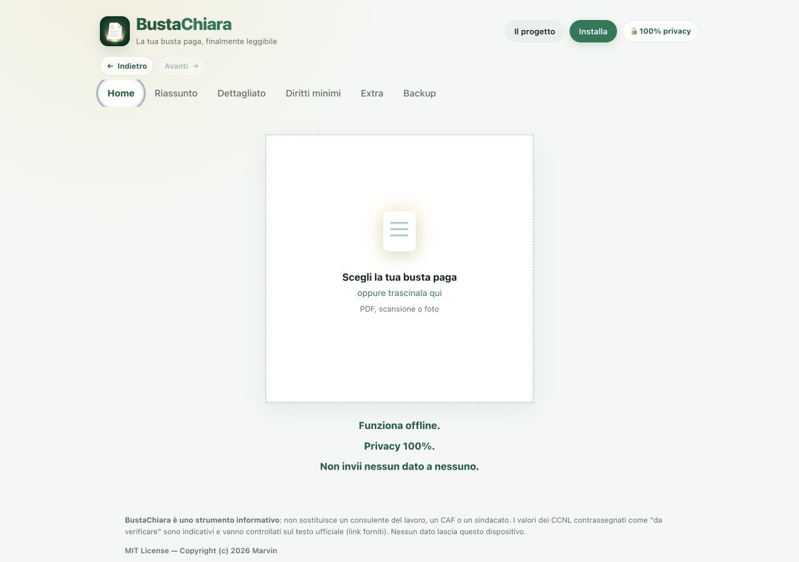
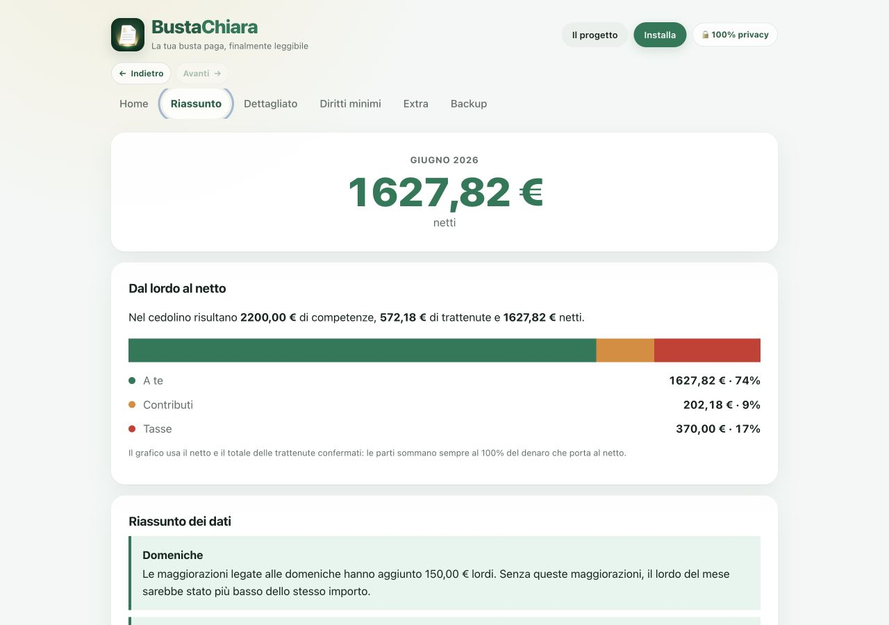
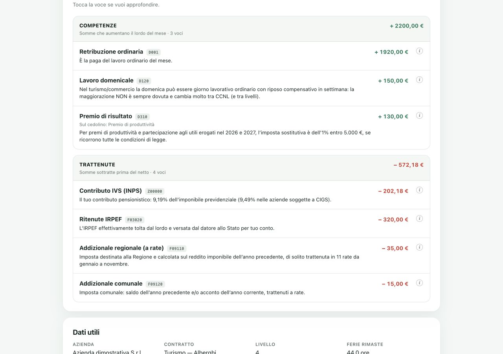

# BustaChiara

**La busta paga dovrebbe essere semplice: parla dei nostri soldi.**

BustaChiara trasforma un cedolino italiano in un riassunto comprensibile, spiega le singole
voci e segnala i dati da ricontrollare. È nata anche per evitare di caricare buste paga,
codici fiscali e retribuzioni su ChatGPT o su altre intelligenze artificiali online.

L'analisi avviene nel browser, sul dispositivo. Non serve un account e non esiste un server
di BustaChiara a cui inviare il documento.

> **Stato del progetto: Alpha.** BustaChiara è ancora in fase di sviluppo e alcune funzioni
> possono cambiare o presentare errori. L'APK per Android verrà realizzato e pubblicato in
> questo repository quando l'applicazione avrà raggiunto una stabilità ottimale. Fino ad
> allora, su Android è possibile installare e usare la PWA seguendo le istruzioni qui sotto.

## Come funziona

Gli screenshot seguenti usano esclusivamente nomi e importi inventati.

### 1. Carica la busta paga

Trascina un PDF, una scansione o una foto nella Home. Il documento viene elaborato sul
dispositivo.



### 2. Leggi il riassunto

Il Riassunto mostra subito netto, trattenute, grafico e ciò che ha cambiato il mese.



### 3. Approfondisci le singole voci

In Dettagliato competenze e trattenute sono separate e ogni voce viene spiegata in modo
semplice.



> **Importante:** un'intelligenza artificiale può sbagliare e anche BustaChiara può
> sbagliare. Layout nuovi, scansioni rovinate e causali aziendali possono essere letti male.
> Prima di salvare, confronta sempre i dati con il documento originale. L'app aiuta a capire:
> non sostituisce un consulente del lavoro, CAF, patronato o sindacato.

## Usala subito

**[Apri BustaChiara](https://MarvinBonazzo.github.io/bustachiara/)**

1. Trascina un PDF, una scansione o una foto nel riquadro della Home.
2. Scegli **Salva e analizza** per proseguire subito oppure **Controlla i dati** per vedere
   documento e campi affiancati.
3. L'app apre il **Riassunto**. In **Dettagliato** puoi toccare ogni voce per capirla.
4. Usa **Indietro** e **Avanti**, oppure le frecce del browser, per tornare alle schermate
   visitate senza perdere il cedolino selezionato.
5. Fai periodicamente **Backup → Esporta tutto**: i dati non si sincronizzano da soli.

## Installazione semplice

BustaChiara è una PWA: si apre da un link e può essere installata come una normale app,
senza App Store o Play Store.

### iPhone e iPad

1. Apri il [link dell'app](https://MarvinBonazzo.github.io/bustachiara/) con **Safari**.
2. Tocca **Condividi** — il quadrato con la freccia verso l'alto.
3. Scegli **Aggiungi alla schermata Home**.
4. Tocca **Aggiungi** e poi apri la nuova icona.

### Android

1. Apri il [link dell'app](https://MarvinBonazzo.github.io/bustachiara/) con Chrome o un
   browser compatibile con le PWA.
2. Tocca il menu **⋮**.
3. Scegli **Installa app** o **Aggiungi alla schermata Home**.
4. Conferma con **Installa**.

### Windows e Linux

1. Apri il [link dell'app](https://MarvinBonazzo.github.io/bustachiara/) con Chrome o Edge.
2. Clicca l'icona di installazione nella barra degli indirizzi; in alternativa apri il menu
   del browser e scegli **Installa BustaChiara**.
3. Conferma. L'app comparirà nel menu delle applicazioni e può avere un collegamento sul
   desktop.

Firefox può usare l'app come sito; per installarla sul desktop sono consigliati Chrome o
Edge.

### macOS

- Con Safari 17 o successivo: apri il link e scegli **File → Aggiungi al Dock**.
- Con Chrome o Edge: usa l'icona di installazione nella barra degli indirizzi.

### Offline e aggiornamenti

La prima apertura richiede internet per scaricare i file dell'app. Dopo il caricamento,
BustaChiara funziona anche offline. Quando torni online, gli aggiornamenti pubblicati
vengono scaricati automaticamente. Le stesse istruzioni sono disponibili nel pulsante
**Installa** dentro l'app.

## Privacy: come funziona davvero

- Il PDF, la foto, il testo OCR e i valori estratti vengono elaborati localmente.
- Non vengono usati ChatGPT, API di AI, analytics, pubblicità o backend applicativi.
- pdf.js, Tesseract, PP-OCRv5 e ONNX Runtime Web sono inclusi nel progetto. Sono strumenti
  locali di lettura del documento, non servizi cloud.
- La Content Security Policy blocca connessioni verso terze parti. La stessa origine è
  permessa soltanto per caricare e aggiornare gli asset statici della PWA; il documento non
  fa parte di queste richieste.
- Il file originale non viene archiviato. Dopo la conferma restano nel `localStorage` solo
  il record estratto e i metadati utili.
- Cancellare i dati del sito cancella anche l'archivio locale. Un export contiene dati in
  chiaro e va trattato come un documento riservato.

Il progetto è open source: chiunque può controllare queste affermazioni direttamente in
[`src/template.html`](src/template.html), [`src/ui.js`](src/ui.js) e
[`pwa/sw.js`](pwa/sw.js).

## Cosa legge

La pipeline gestisce PDF nativi, PDF protetti da password, scansioni e fotografie. Cerca:

- periodo, dipendente, azienda, livello, qualifica e codice CNEL;
- elementi fissi, voci economiche, base, riferimento, unità, competenze e trattenute;
- netto, totali, contributi, IRPEF, addizionali, TFR, ferie, permessi, ratei e progressivi;
- tabelle presenze e calendario, senza scambiare automaticamente ore o anni per euro;
- più pagine, più tabelle nella stessa pagina e descrizioni spezzate su più righe;
- terminologia di LUL privato, NoiPA, lavoro domestico, edilizia, agricoltura, sanità,
  dirigenti, sport/spettacolo, marittimi, cessazioni e conguagli.

In **Dettagliato** ogni voce conosciuta dice in parole semplici che cosa rappresenta e
perché compare. Per esempio:

- l'addizionale regionale finanzia funzioni della Regione ed è normalmente calcolata sul
  reddito imponibile dell'anno precedente, in base al domicilio fiscale;
- l'addizionale comunale finanzia il Comune e può apparire come saldo dell'anno precedente
  e acconto dell'anno corrente;
- contributi INPS, IRPEF, detrazioni, fondi, assenze, premi e mensilità aggiuntive spiegano
  sia il significato sia il motivo della presenza nel cedolino.

Le aliquote ufficiali delle addizionali sono consultabili nelle tabelle del Dipartimento
delle Finanze: [regionali](https://www1.finanze.gov.it/finanze2/dipartimentopolitichefiscali/fiscalitalocale/addregirpef/download/tabella.htm)
e [comunali](https://www1.finanze.gov.it/finanze2/dipartimentopolitichefiscali/fiscalitalocale/nuova_addcomirpef/download/tabella.htm).

## Precisione: che cosa significa “testato”

Non è serio promettere “qualsiasi cedolino al 100%”. I software paghe sono configurabili,
alcuni documenti sono immagini degradate e le causali interne possono avere qualunque nome.

BustaChiara usa una regola più prudente:

- la suite deve ottenere il **100% delle asserzioni attese nel corpus di regressione**;
- valori, segni e colonne vengono verificati separatamente;
- i totali devono quadrare e nessuna riga economica deve essere inventata;
- i casi a bassa affidabilità devono chiedere controllo, non fingere certezza;
- ogni nuovo layout aggiunge un test, così una correzione non rompe i formati già gestiti.

Le fixture sono sintetiche, con dati inventati, ma riproducono anche coordinate, tabelle e
impaginazioni multipagina studiate su documentazione pubblica. Il risultato sul corpus non
è una garanzia universale: è una misura ripetibile e controllabile.

Stato attuale del benchmark: **27/27 cedolini sintetici**, **6 layout a coordinate**,
**111 voci** e **495/495 asserzioni** superate. Un corpus negativo separato respinge
**6/6 documenti fuori ambito**: CU, 730, F24, contratto, prospetto presenze e cedolino
pensione.

## Come funziona tecnicamente

| Parte | Tecnologia | Compito |
|---|---|---|
| Interfaccia | HTML, CSS, JavaScript vanilla | import, navigazione, verifica, riassunto e backup |
| PDF nativi | pdf.js 3.11.174 | estrae testo, pagina e coordinate |
| Scansioni e foto | Tesseract.js + PP-OCRv5/ONNX Runtime Web | OCR locale con più letture e confronto prudente |
| Parser | regole geometriche e semantiche in JavaScript | ricostruisce righe, colonne, sezioni e campi |
| Controlli | formule esplicite | quadrature, importi, ratei, TFR, fisco e coerenza |
| Contratti | indice Open Data CNEL + schede curate | riconoscimento del codice e controlli disponibili |
| Memoria | `localStorage` | record confermati e correzioni locali |
| PWA | Manifest, Service Worker, Cache Storage | installazione, cache e uso offline |

Il parser non prende semplicemente il primo numero vicino a una parola. Conserva candidati
alternativi con pagina, coordinate, metodo e affidabilità; riconosce il ruolo delle colonne;
confronta somma delle competenze, somma delle trattenute e netto; poi collega il valore alla
zona del documento mostrata nella verifica affiancata.

Le correzioni a causali proprietarie e il profilo del formato restano sul dispositivo. Non
vengono usati per addestrare un modello remoto e non lasciano il browser.

## Avvio locale per chi vuole contribuire

Non è necessario conoscere framework e non serve `npm install`. Occorre soltanto
[Node.js 22](https://nodejs.org/) o successivo.

```bash
git clone https://github.com/ShivenBonazzo/bustachiara.git
cd bustachiara
node tests/parser.test.mjs
node tests/parser-matrix.test.mjs
node tests/non-payslip-gaps.test.mjs
node tests/data-explanations.test.mjs
node tests/ai-ocr.test.mjs
node tests/recognition.test.mjs
node tests/ui-pwa.test.mjs
node build.mjs
```

Per aprire la build come PWA:

```bash
python3 -m http.server 8000 --directory pwa
```

Poi visita `http://localhost:8000`. Su Windows puoi usare
`py -m http.server 8000 --directory pwa`.

Modifica i file in `src/`: `pwa/index.html` è generato da `node build.mjs` e non va
modificato a mano.

### Dove intervenire

| Obiettivo | File |
|---|---|
| riconoscere campi, colonne o layout | `src/parser.js` |
| aggiungere termini di un settore | `src/parser-sectors.js` |
| spiegare una voce o aggiornare una fonte | `src/data.js` |
| modificare formule e controlli | `src/checks.js` |
| modificare flusso e interfaccia | `src/ui.js`, `src/template.html`, `src/app.css` |
| aggiungere un caso di regressione | `tests/fixtures/`, `tests/*.test.mjs` |
| aggiornare l'indice CNEL | `node scripts/update-cnel.mjs` |

Il metodo completo del parser, le famiglie studiate e i limiti noti sono descritti in
[`docs/parser-research.md`](docs/parser-research.md).

## Pubblicare il proprio fork su GitHub Pages

1. Crea un fork oppure un nuovo repository pubblico su GitHub.
2. Carica questi file sul branch `main`.
3. Apri **Settings → Pages**.
4. In **Build and deployment**, scegli **GitHub Actions**.
5. Esegui il workflow **Deploy BustaChiara PWA** oppure fai un push su `main`.
6. GitHub mostrerà il link pubblico al termine del workflow.

La CI esegue parser, matrice coordinate, spiegazioni, OCR, riconoscimento, UI e build prima
della pubblicazione. L'indice CNEL viene aggiornato settimanalmente da un workflow separato.

## Contribuire senza esporre nessuno

BustaChiara è open source. Sono utili codice, test, documentazione, accessibilità,
correzioni normative e nuovi layout. Chi contribuisce concretamente viene inserito nella
lista dei contributori con il nome o nickname scelto.

**Non aprire mai una Issue allegando un cedolino reale.** GitHub è pubblico. Usa un fixture
con identità e importi inventati seguendo [`CONTRIBUTING.md`](CONTRIBUTING.md). Per un
problema di sicurezza usa invece le istruzioni private in [`SECURITY.md`](SECURITY.md).

## Fonti strutturali pubbliche

Per ampliare il parser sono state studiate, senza includere i documenti nel repository:

- [NoiPA — come si legge il cedolino](https://noipa.mef.gov.it/cl/come-si-legge-il-cedolino-noipa);
- [EBR Piemonte — manuale del cedolino LUL](https://www.ebrpiemonte.it/images/documenti/2022/manuali/MANUALE_LEGGERE_ED_INTERPRETARE_IL_CEDOLINO_PAGA.pdf);
- [TeamSystem — struttura multipagina LYNFA](https://marketing.teamsystem.com/diretta-professionisti/dem-diretta-prof/newsletter-marzo-2018-dir-prof);
- [lavoro domestico — facsimile pubblico](https://workledger.it/modulistica/fac-simile-busta-paga-colf-badante.pdf);
- [Cassa Edile Brescia — casi ordinario, malattia, infortunio e impiegato](https://www.cassaedilebrescia.it/wp-content/uploads/2023/01/2022-01-GENNAIO-2022-BUSTE-PAGA.pdf);
- [CNEL — contratti Open Data](https://www.cnel.it/archivio-contratti/contratti-open-data).

Tutte le fixture nel repository usano dati inventati. Non sono presenti buste paga, nomi o
codici fiscali reali.

## Licenza e responsabilità

Codice distribuito con licenza [MIT](LICENSE).

BustaChiara è uno strumento informativo e didattico. Le norme, aliquote e interpretazioni
possono cambiare; controlla la fonte ufficiale e chiedi assistenza qualificata quando una
differenza può incidere sui tuoi diritti o sul tuo denaro.
